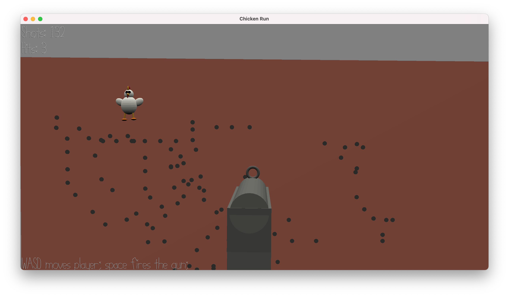

# Chicken Run

Author: Sacha Bartholme

Design: Inpsired by the 2000 stop-motion animated comedy film "[Chicken Run](https://en.wikipedia.org/wiki/Chicken_Run)", a hunter needs to shoot down a moving chicken.

Screen Shot:

How To Play:

WASD moves the gun/player. Space fires the gun.

This game was built with [NEST](NEST.md).
